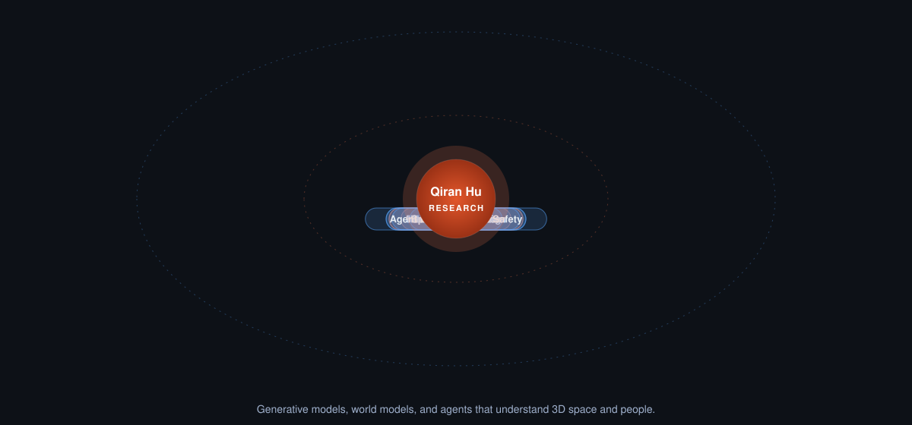

<!-- Generated cards live in assets/ (node scripts/render-assets.mjs) and on the output branch (GitHub Actions). -->
<picture>
  <source media="(prefers-color-scheme: dark)" srcset="assets/hero-dark.svg">
  <source media="(prefers-color-scheme: light)" srcset="assets/hero-light.svg">
  
</picture>

  qiranhu8@gmail.com | +1 (347)-957-9176 | <a href="https://edward-h26.github.io/">https://edward-h26.github.io/</a> | <a href="https://edward-h26.github.io/PersonalWebsite/">3D Portfolio</a>

   
  

  

  

    I am a current student in <strong><a href="https://www.engineering.columbia.edu/about">Fu Foundation School of Engineering and Applied Science</a></strong> at <strong><a href="https://www.columbia.edu/">Columbia University</a></strong>.
  

  

    I am a research assistant in the <strong><a href="https://vision.ischool.illinois.edu/index.html">Computer Vision and Machine Learning Group</a></strong> at <strong><a href="https://www.illinois.edu/">University of Illinois Urbana-Champaign</a></strong>. I am also affiliated with the <strong><a href="https://www.ncsa.illinois.edu/">National Center for Supercomputing Applications</a></strong> and <strong><a href="https://nairrpilot.org/">National Artificial Intelligence Research Resource Pilot</a></strong>.
  

  

    Previously, I received my B.S. in Data Science and Information Science with minors in Computer Science and Statistics at <strong><a href="https://www.illinois.edu/">University of Illinois Urbana-Champaign</a></strong>.
  

  

    I am an applied AI researcher and full-stack software engineer creating new ways for people to interact with AI. I push the frontier of agentic experiences through rapid internal experiments. My research spans self-evolving multi-agent orchestration, dynamic context engineering for long-term memory, 3D-aware generative modeling, multimodal reasoning, and the next generation of human-AI interfaces.
  

## Research Focus

<a href="https://edward-h26.github.io/research/">
<picture>
  <source media="(prefers-color-scheme: dark)" srcset="assets/research-orbit-dark.svg">
  <source media="(prefers-color-scheme: light)" srcset="assets/research-orbit-light.svg">
  
</picture>
</a>

## Featured Paper

<a href="https://arxiv.org/abs/2606.31204">
<picture>
  <source media="(prefers-color-scheme: dark)" srcset="assets/featured-paper-dark.svg">
  <source media="(prefers-color-scheme: light)" srcset="assets/featured-paper-light.svg">
  
</picture>
</a>

  
  
  

## News

- **[June 2026]** Our paper [AC3S: Adaptive Conditioning for 3D-Aware Synthetic Data Generation](https://arxiv.org/abs/2606.31204) is accepted to the [European Conference on Computer Vision (ECCV) 2026](https://eccv.ecva.net/).

## Journey

<picture>
  <source media="(prefers-color-scheme: dark)" srcset="assets/timeline-dark.svg">
  <source media="(prefers-color-scheme: light)" srcset="assets/timeline-light.svg">
  
</picture>

## Education

  
  <strong>Columbia University</strong>, New York City, NY 
  <strong>MS in Data Science</strong> 
  Fu Foundation School of Engineering and Applied Science 
  <em>2026.08 - 2028.05</em>

 

  
  <strong>University of Illinois at Urbana-Champaign</strong>, Champaign, IL 
  <strong>BS in Data Science and Information Science</strong> 
  Minors: Computer Science and Statistics 
  Siebel School of Computing and Data Science 
  <em>2022.08 - 2026.05</em>

 

## Papers

1. Eric Ji, **Qiran Hu**, Wufei Ma, Sarthak Jain, Yingying Li, Minh N. Do, Yaoyao Liu. **AC3S: Adaptive Conditioning for 3D-Aware Synthetic Data Generation.** European Conference on Computer Vision (ECCV) 2026. 
   
   
   
2. Hangyue Zhang, **Qiran Hu**, Ziyi Zhang, Yun Huang. **Crowdsourced Open-Source Research: A Research Paradigm Probe.** Under Review.
3. Tuan Minh Nguyen, **Qiran Hu**, Banruo Liu, Khoa D Doan, Kok-Seng Wong, Fan Lai. **Context Under Budget: A Controlled Benchmark for Post-Retrieval Compression in Retrieval-Augmented Generation.** Under Review.
4. Sarthak Jain, **Qiran Hu**, Zhen Zhu, Yaoyao Liu. **AlphaWiseFT: Adaptive Weight Interpolation for Continual Multimodal Representation Learning.** Under Review.

## Research Groups

### **UIUC Computer Vision and Machine Learning Group**
**Undergraduate Research Assistant, advised by Professor Yaoyao Liu**

- Develop 3D-consistent generative models for world understanding and embodied AI, and implement diffusion-based approaches for spatially coherent scene synthesis with applications in interactive simulation.
- Investigate real-time 3D reconstruction methods for interactive experiences and integrate neural rendering with depth estimation for embodied agent perception systems.
- Train large-scale vision transformers on TB-level image datasets using a high-performance computing cluster through distributed training at the National Center for Supercomputing Applications (NCSA), optimizing spatial tokenization and enforcing multi-view consistency for 3D-aware diffusion-based scene generation.

### **UIUC Social Computing System Lab**
**Undergraduate Research Assistant, advised by Professor Yun Huang**

- Architect streaming video-language models with temporal transformer blocks for long-form video understanding beyond 30-minute sequences with competitive zero-shot accuracy.
- Build joint audio-visual perception pipelines for human-centric social understanding, fusing facial action units, body pose dynamics, and acoustic prosody through cross-modal attention to predict social intent and conversational role in clinical sessions.
- Design a context fluidity framework for personalized AI adaptation, advancing from static prompt engineering toward dynamic context engineering that models individual communication preferences and emotional states across conversation sessions.

## Research Experience

### **Multi-modal Generative Models for Large-scale Continual Learning**
**Undergraduate Research Assistant** 
_2026.02 - Present_

- Selected for the NVIDIA Academic Grant Program Award with 32,000 A100 GPU-hours allocated on the Brev cloud platform to advance multimodal generative models that continuously incorporate new knowledge across text, image, and 3D data without catastrophic forgetting of previously learned cross-modal alignment.
- Scaled multimodal continual-learning experiments across audio, image, and text modalities through distributed training on the National Artificial Intelligence Research Resource (NAIRR), profiling throughput and memory trade-offs to enable post-hoc weight-space fusion.
- Optimized parameter-efficient post-hoc fusion framework that learns to compose frozen checkpoints from different continual-learning strategies.

### **Multi-agent HCI Research Synthesis Engine**
**Systems Architect** 
_2025.11 - Present_

- Architected an 8-agent orchestration system for HCI literature synthesis, implementing specialized agents of Planner, Researcher, Writer, Critic, SafetyGuardian, ReflexionEngine, LLMJudge, and Evaluation across a 12-step reasoning workflow, achieving 0.955 overall evaluation score, 0.925 on relevance, safety, and clarity.
- Designed Model Context Protocol integration for standardized tool interfaces, enabling seamless connection between LLM agents and external data sources, including academic databases, code repositories, and document management systems.
- Constructed parallel tool-calling infrastructure integrating Semantic Scholar API and Tavily web search with ThreadPoolExecutor, reducing query latency 40% (8.2s to 4.9s) and adding production-grade fallback handling for API failures.

### **Node Optimized Orchestration Design for Educational Intelligence Architecture**
**Full Stack Developer** 
_2025.08 - Present_

- Built a K-12 intelligent tutoring platform integrating multi-agent orchestration with memory-enhanced GraphRAG and designed an adaptive learning system that personalizes responses beyond static Q&A.
- Implemented a self-evolving long-term memory module that retrieves contextually relevant prior interactions, addressing the recency bias of FIFO memory structures used in standard RAG systems.
- Deployed to 2 partner institutions and iterated through 6 development cycles incorporating user feedback to refine interface design and response quality based on student engagement data.

## Professional Experience

### **Computer Vision and Machine Learning Group, Champaign, IL**
**Undergraduate Research Assistant** 
_2025.05 - Present_

- Designed a consistency-trajectory distillation framework that compresses multi-step 3D-aware diffusion teachers into single-step student samplers conditioned on 3D pose and depth.
- Built a parameter-efficient continual-learning pipeline for billion-parameter large multimodal models, extending the partial-retraining methodology with Fisher-aware adapter routing.
- Generalized weight-space interpolation from Euclidean linear combinations to Fisher-Rao geodesic interpolation across continual checkpoints.
- Conducted experiments on real-time 3D reconstruction and visual-inertial odometry for embodied agent perception systems by evaluating spatial intelligence metrics for world model applications.

### **UIUC Student Affairs, WRC Department, Champaign, IL**
**Data Analyst** 
_2024.08 - 2024.12_

- Conducted rigorous statistical analysis of student performance metrics and survey responses among 19,800 students and implemented a comprehensive data analysis framework for the program.
- Leveraged complex institutional datasets to generate actionable insights by enhancing strategic planning processes and contributing to a 6.5% improvement in resource allocation for student success programs.
- Designed and implemented comprehensive program evaluation frameworks for key educational initiatives by utilizing mixed-methods research to analyze effectiveness.

<strong>Leadership Experience</strong> (click to expand)

### **CS 107 Data Science Discovery, University of Illinois at Urbana-Champaign, IL, United States**
**Teaching Assistant** 
_2023.08 - Present_

- Facilitated weekly in-person/online office hours and lab sections to provide technical assistance for over 2,000 students.
- Authored instructional content for DISCOVERY's Guides explaining data science concepts through applied Python examples.
- Designed advanced problem sets, exam questions, test suites, and autograder scripts for DISCOVERY's Mastery Platform.

### **Student Government, University of Illinois at Urbana-Champaign, IL, United States**
**iSchool Student Representative** 
_2022.09 - 2023.09_

- Supervised iSchool community forums to handle student concerns with adherence to predetermined guidelines.
- Facilitated with the university and prospective students and parents during campus tours, answering questions, and providing insight.
- Secured approval for program modifications to existing and new activities from students' feedback.

<strong>Project Experience</strong> (click to expand)

### **Realistic Neural Style Transfer Architecture**
**Independent Researcher** 
_2025.01 - 2025.08_

- Proposed a multi-scale neural style transfer architecture for transferring abstract art styles onto photographic content, combining VGG-based perceptual losses with edge-preserving structural constraints to retain global content geometry.
- Reduced texture and chromatic distortion artifacts common in patch-based and single-layer loss formulations through a multi-layer Gram matrix loss with adaptive layer weighting.

### **Anime Statistics and Analysis Platform**
**Project Lead** 
_2025.02 - 2025.06_

- Built interactive analytics platform using anime data API for popularity trend visualization and predictive analysis of market opportunities.

## Honors

- [Neo4j Certified Professional](https://graphacademy.neo4j.com/c/2e386da7-2b30-4575-9fd0-b0b0918a6fe0/)
- [Neo4j Graph Data Science Certification](https://graphacademy.neo4j.com/c/6559f827-9dca-4199-bc9d-8be10fd74891/)
- UIUC Dean's List - 2023 Spring, 2024 Fall, 2025 Spring, 2025 Fall, 2026 Spring
- UIUC James Scholar

## Skills

<picture>
  <source media="(prefers-color-scheme: dark)" srcset="assets/skills-marquee-dark.svg">
  <source media="(prefers-color-scheme: light)" srcset="assets/skills-marquee-light.svg">
  
</picture>

**Technical Stacks:** Python, C++, PostgreSQL, Neo4j, MongoDB, React.js, Typescript.js, Next.js, Angular.js, Vue.js, Javascript, HTML5, Tailwind CSS, Ruby, Java, R, Kotlin, PHP, Cloud DevOps, Unity, SAS, Figma, Canva, Microsoft Office Suite, Adobe Creative Suite, and Arduino UNO 
**Language:** Chinese (native), English (native), Spanish (elementary)

## GitHub Activity

<picture>
  <source media="(prefers-color-scheme: dark)" srcset="https://raw.githubusercontent.com/Edward-H26/Edward-H26/output/stats-dark.svg">
  <source media="(prefers-color-scheme: light)" srcset="https://raw.githubusercontent.com/Edward-H26/Edward-H26/output/stats-light.svg">
  
</picture>

<picture>
  <source media="(prefers-color-scheme: dark)" srcset="https://raw.githubusercontent.com/Edward-H26/Edward-H26/output/activity-dark.svg">
  <source media="(prefers-color-scheme: light)" srcset="https://raw.githubusercontent.com/Edward-H26/Edward-H26/output/activity-light.svg">
  
</picture>

  <picture>
    <source media="(prefers-color-scheme: dark)" srcset="https://raw.githubusercontent.com/Edward-H26/Edward-H26/output/profile-night-rainbow.svg">
    <source media="(prefers-color-scheme: light)" srcset="https://raw.githubusercontent.com/Edward-H26/Edward-H26/output/profile-green-animate.svg">
    
  </picture>

<picture>
  <source media="(prefers-color-scheme: dark)" srcset="https://raw.githubusercontent.com/Edward-H26/Edward-H26/output/github-snake-dark.svg" />
  <source media="(prefers-color-scheme: light)" srcset="https://raw.githubusercontent.com/Edward-H26/Edward-H26/output/github-snake.svg" />
  
</picture>

  

<strong>Feel free to contact me!</strong>

<picture>
  <source media="(prefers-color-scheme: dark)" srcset="assets/footer-dark.svg">
  <source media="(prefers-color-scheme: light)" srcset="assets/footer-light.svg">
  
</picture>
