<!-- Generated cards live in assets/ (node scripts/render-assets.mjs) and on the output branch (GitHub Actions). -->
<picture>
  <source media="(prefers-color-scheme: dark)" srcset="assets/hero-dark.svg" />
  <source media="(prefers-color-scheme: light)" srcset="assets/hero-light.svg" />
  
</picture>

<!-- links:start -->

  <a href="https://scholar.google.com/citations?user=4jv03f4AAAAJ&amp;hl=en" title="Google Scholar"><picture><source media="(prefers-color-scheme: dark)" srcset="assets/link-scholar-dark.svg" /><source media="(prefers-color-scheme: light)" srcset="assets/link-scholar-light.svg" /></picture></a>&nbsp;&nbsp;
  <a href="https://edward-h26.github.io/" title="Website"><picture><source media="(prefers-color-scheme: dark)" srcset="assets/link-website-dark.svg" /><source media="(prefers-color-scheme: light)" srcset="assets/link-website-light.svg" /></picture></a>&nbsp;&nbsp;
  <a href="https://www.linkedin.com/in/qiranhu/" title="LinkedIn"><picture><source media="(prefers-color-scheme: dark)" srcset="assets/link-linkedin-dark.svg" /><source media="(prefers-color-scheme: light)" srcset="assets/link-linkedin-light.svg" /></picture></a>&nbsp;&nbsp;
  <a href="mailto:qh2332@columbia.edu" title="Email"><picture><source media="(prefers-color-scheme: dark)" srcset="assets/link-email-dark.svg" /><source media="(prefers-color-scheme: light)" srcset="assets/link-email-light.svg" /></picture></a>&nbsp;&nbsp;
  <a href="https://x.com/QiranHu" title="X"><picture><source media="(prefers-color-scheme: dark)" srcset="assets/link-x-dark.svg" /><source media="(prefers-color-scheme: light)" srcset="assets/link-x-light.svg" /></picture></a>

+1 (347)-957-9176

<!-- links:end -->

  

    I am a current student in <strong><a href="https://www.engineering.columbia.edu/about">Fu Foundation School of Engineering and Applied Science</a></strong> at <strong><a href="https://www.columbia.edu/">Columbia University</a></strong>.
  

  

    I am a research assistant in the <strong><a href="https://vision.ischool.illinois.edu/index.html">Computer Vision and Machine Learning Group</a></strong> at <strong><a href="https://www.illinois.edu/">University of Illinois Urbana-Champaign</a></strong>. I am also affiliated with the <strong><a href="https://www.ncsa.illinois.edu/">National Center for Supercomputing Applications</a></strong> and <strong><a href="https://nairrpilot.org/">National Artificial Intelligence Research Resource Pilot</a></strong>.
  

  

    Previously, I received my B.S. in Data Science and Information Science with minors in Computer Science and Statistics at <strong><a href="https://www.illinois.edu/">University of Illinois Urbana-Champaign</a></strong>.
  

  

    I am an applied AI researcher and full-stack software engineer creating new ways for people to interact with AI. I push the frontier of agentic experiences through rapid internal experiments. My research spans self-evolving multi-agent orchestration, dynamic context engineering for long-term memory, 3D-aware generative modeling, multimodal reasoning, and the next generation of human-AI interfaces.
  

## Research Focus

<a href="https://edward-h26.github.io/research/">
<picture>
  <source media="(prefers-color-scheme: dark)" srcset="assets/scenes/planet-dark.webp" />
  <source media="(prefers-color-scheme: light)" srcset="assets/scenes/planet-light.webp" />
  
</picture>
</a>

## Featured Papers

<!-- featured-paper:start -->
<table width="100%">
<tr>
<td width="400" valign="top"></td>
<td valign="top">
<b><a href="https://arxiv.org/abs/2606.31204">AC3S: Adaptive Conditioning for 3D-Aware Synthetic Data Generation</a></b> 
Eric Ji, <b>Qiran Hu</b>, Wufei Ma, Sarthak Jain, Yingying Li, Minh N. Do, Yaoyao Liu 
<i>European Conference on Computer Vision (<b>ECCV</b>), 2026</i>  
<a href="https://arxiv.org/abs/2606.31204"><picture><source media="(prefers-color-scheme: dark)" srcset="assets/paper-link-arxiv-dark.svg" /><source media="(prefers-color-scheme: light)" srcset="assets/paper-link-arxiv-light.svg" /></picture></a>
<a href="https://ac3s.cvmlgroup.web.illinois.edu/"><picture><source media="(prefers-color-scheme: dark)" srcset="assets/paper-link-code-dark.svg" /><source media="(prefers-color-scheme: light)" srcset="assets/paper-link-code-light.svg" /></picture></a>
<a href="https://youtu.be/3jOJaT2a8iQ"><picture><source media="(prefers-color-scheme: dark)" srcset="assets/paper-link-video-dark.svg" /><source media="(prefers-color-scheme: light)" srcset="assets/paper-link-video-light.svg" /></picture></a>
<a href="https://arxiv.org/bibtex/2606.31204"><picture><source media="(prefers-color-scheme: dark)" srcset="assets/paper-link-bibtex-dark.svg" /><source media="(prefers-color-scheme: light)" srcset="assets/paper-link-bibtex-light.svg" /></picture></a>
</td>
</tr>
</table>

<table width="100%">
<tr>
<td width="400" valign="top"></td>
<td valign="top">
<b><a href="https://arxiv.org/abs/2609.11209">REVA: Reusable Evidence View Aggregation for Context-Efficient RAG Serving</a></b> 
Tuan Nguyen, <b>Qiran Hu</b>, Banruo Liu, Khoa D. Doan, Kok-Seng Wong, Fan Lai 
<i>IEEE International Conference on Data Mining (<b>ICDM</b>), 2026</i>  
<a href="https://arxiv.org/abs/2609.11209"><picture><source media="(prefers-color-scheme: dark)" srcset="assets/paper-link-arxiv-dark.svg" /><source media="(prefers-color-scheme: light)" srcset="assets/paper-link-arxiv-light.svg" /></picture></a>
<a href="https://github.com/UIUC-MLSys/REVA"><picture><source media="(prefers-color-scheme: dark)" srcset="assets/paper-link-code-dark.svg" /><source media="(prefers-color-scheme: light)" srcset="assets/paper-link-code-light.svg" /></picture></a>
<a href="https://arxiv.org/bibtex/2609.11209"><picture><source media="(prefers-color-scheme: dark)" srcset="assets/paper-link-bibtex-dark.svg" /><source media="(prefers-color-scheme: light)" srcset="assets/paper-link-bibtex-light.svg" /></picture></a>
</td>
</tr>
</table>
<!-- featured-paper:end -->

## News

- **[September 2026]** I presented our [AC3S poster](https://eccv.ecva.net/virtual/2026/poster/5183) at [ECCV 2026](https://eccv.ecva.net/Conferences/2026) in [Malmö, Sweden](https://eccv.ecva.net/Conferences/2026/Venues), [ExHall #107 on September 12](https://eccv.ecva.net/virtual/2026/poster/5183).
- **[August 2026]** Our paper [REVA: Reusable Evidence View Aggregation for Context-Efficient RAG Serving](https://arxiv.org/abs/2609.11209) is accepted to the [IEEE International Conference on Data Mining (ICDM) 2026](https://www.datamining.org/).
- **[June 2026]** Our paper [AC3S: Adaptive Conditioning for 3D-Aware Synthetic Data Generation](https://arxiv.org/abs/2606.31204) is accepted to the [European Conference on Computer Vision (ECCV) 2026](https://eccv.ecva.net/).

## Interactive 3D Portfolio

Click the preview to walk the island: scroll to move, look sideways with the arrow keys. Built with React and three.js.

## Papers

<!-- papers:start -->
<table width="100%">
<tr>
<td width="300" valign="top"></td>
<td valign="top">
<b><a href="https://arxiv.org/abs/2606.31204">AC3S: Adaptive Conditioning for 3D-Aware Synthetic Data Generation</a></b> 
Eric Ji, <b>Qiran Hu</b>, Wufei Ma, Sarthak Jain, Yingying Li, Minh N. Do, Yaoyao Liu 
<i>European Conference on Computer Vision (<b>ECCV</b>), 2026</i>  
<a href="https://arxiv.org/abs/2606.31204"><picture><source media="(prefers-color-scheme: dark)" srcset="assets/paper-link-arxiv-dark.svg" /><source media="(prefers-color-scheme: light)" srcset="assets/paper-link-arxiv-light.svg" /></picture></a>
<a href="https://ac3s.cvmlgroup.web.illinois.edu/"><picture><source media="(prefers-color-scheme: dark)" srcset="assets/paper-link-code-dark.svg" /><source media="(prefers-color-scheme: light)" srcset="assets/paper-link-code-light.svg" /></picture></a>
<a href="https://youtu.be/3jOJaT2a8iQ"><picture><source media="(prefers-color-scheme: dark)" srcset="assets/paper-link-video-dark.svg" /><source media="(prefers-color-scheme: light)" srcset="assets/paper-link-video-light.svg" /></picture></a>
<a href="https://arxiv.org/bibtex/2606.31204"><picture><source media="(prefers-color-scheme: dark)" srcset="assets/paper-link-bibtex-dark.svg" /><source media="(prefers-color-scheme: light)" srcset="assets/paper-link-bibtex-light.svg" /></picture></a>
</td>
</tr>
</table>

<table width="100%">
<tr>
<td width="300" valign="top"></td>
<td valign="top">
<b><a href="https://arxiv.org/abs/2609.11209">REVA: Reusable Evidence View Aggregation for Context-Efficient RAG Serving</a></b> 
Tuan Nguyen, <b>Qiran Hu</b>, Banruo Liu, Khoa D. Doan, Kok-Seng Wong, Fan Lai 
<i>IEEE International Conference on Data Mining (<b>ICDM</b>), 2026</i>  
<a href="https://arxiv.org/abs/2609.11209"><picture><source media="(prefers-color-scheme: dark)" srcset="assets/paper-link-arxiv-dark.svg" /><source media="(prefers-color-scheme: light)" srcset="assets/paper-link-arxiv-light.svg" /></picture></a>
<a href="https://github.com/UIUC-MLSys/REVA"><picture><source media="(prefers-color-scheme: dark)" srcset="assets/paper-link-code-dark.svg" /><source media="(prefers-color-scheme: light)" srcset="assets/paper-link-code-light.svg" /></picture></a>
<a href="https://arxiv.org/bibtex/2609.11209"><picture><source media="(prefers-color-scheme: dark)" srcset="assets/paper-link-bibtex-dark.svg" /><source media="(prefers-color-scheme: light)" srcset="assets/paper-link-bibtex-light.svg" /></picture></a>
</td>
</tr>
</table>

<table width="100%">
<tr>
<td width="300" valign="top"></td>
<td valign="top">
<b>ACDN: Agent-Aware Content Delivery Network</b> 
Tuan Nguyen, <b>Qiran Hu</b>, Dibyadeep Saha, Banruo Liu, Khoa D. Doan, Kok-Seng Wong, Fan Lai 
<i>Under Review</i>
</td>
</tr>
</table>

<table width="100%">
<tr>
<td width="300" valign="top"></td>
<td valign="top">
<b>SV4D 3.0: Single-Step 3D-Aware Diffusion for Multi-View-Consistent 4D Scene Generation</b> 
<b>Qiran Hu</b>, Wei Cao, Yaoyao Liu 
<i>Under Review</i>
</td>
</tr>
</table>

<table width="100%">
<tr>
<td width="300" valign="top"></td>
<td valign="top">
<b>AISim: Using LLM-Simulation as Epistemic Scaffolds for Early Stage Qualitative Research Design</b> 
Hangyue Zhang, <b>Qiran Hu</b>, Ziyi Zhang, Hyanghee Park, Yun Huang 
<i>Under Review</i>
</td>
</tr>
</table>

<table width="100%">
<tr>
<td width="300" valign="top"></td>
<td valign="top">
<b>AlphaWiSE: Adaptive Weight Interpolation for Continual Multimodal Representation Learning</b> 
Sarthak Jain, <b>Qiran Hu</b>, Zhen Zhu, Yaoyao Liu 
<i>Under Review</i>
</td>
</tr>
</table>
<!-- papers:end -->

## Research Experience

### **UIUC Computer Vision and Machine Learning Group**
**Undergraduate Research Assistant - Advised by Professor Yaoyao Liu** 
_Champaign, IL · 2025.05 - Present_

- Develop adaptive conditioning methods for 3D-aware synthetic data generation to enhance world model understanding and embodied agent performance in interactive simulations with geometry-conditioned diffusion approaches, reducing FID by 32.8% on ImageNet and enhancing pose accuracy by 4.2x on PASCAL3D+.
- Conduct large-scale foundation model training across TB-level datasets on National Center for Supercomputing Applications (NCSA) HPC clusters to enforce multi-view consistency with 4-bit NF4 quantization and low-level custom kernels, improving pose accuracy by 11.3% on PASCAL3D+ and reducing generation latency by 78.7% at p95.
- Design camera-controlled novel view synthesis on video generation pipelines to advance real-time perception for SLAM, visual odometry, and 3D reconstruction, decreasing LPIPS by 21.0% on GSO and FV4D by 52.0% on OmniObject3D.

### **Multimodal Continual Learning Project**
**Undergraduate Research Assistant** 
_Champaign, IL · 2026.02 - Present_

- Selected for NVIDIA Academic Grant Program Award to streamline multimodal foundation models in class-incremental learning across audio, image, and text without catastrophic forgetting and cross-modal alignment drift, increasing R@1 by 27.6% on AudioSet.
- Implement post-hoc tensor-level weight-interpolation methods for multimodal retrieval on National Artificial Intelligence Research Resource (NAIRR) HPC clusters, minimizing trainable parameters from 182M to 499 sigmoid-parameterized coefficients and increasing R@1 by 33.5% on AudioSet.
- Optimize checkpoint fusion pipelines to compose frozen checkpoints into one deployable model with no additional inference time, boosting last-task accuracy by 40.9% on UrbanSound8K.

### **REVA: Reusable Evidence View Aggregation for Context-Efficient RAG Serving**
**Undergraduate Research Assistant, University of Illinois Urbana-Champaign** 
_Champaign, IL · 2026.02 - 2026.09_

- Proposed attention-based scoring for post-retrieval RAG context compression to reuse generator attention traces across queries and update the system offline, achieving a 91.6% cache hit rate on HotpotQA.
- Developed reusable evidence views to scale compression cost with unique documents rather than query volume, improving F1 by 13.2% on Natural Questions and decreasing online compression overhead by 6.1x at under 40 ms per request.
- Optimized online serving to keep context compression off the GPU critical path for high-volume production RAG traffic under strict per-request latency targets, minimizing compression latency by 99.3% compared to EXIT and 99.8% compared to FaviComp.

## Professional Experience

### **Memoria**
**Founding Technical Lead** 
_Champaign, IL · 2026.01 - Present_

- Lead end-to-end agentic workflow deployments across MCP servers, sub-agents, and agent skills with multi-agent orchestration, permission-aware tool calling, and policy guardrails, accelerating product delivery by 4.0x compared to traditional approaches.
- Manage production operations for deployed workflows with logging, evaluation harnesses, and monthly improvement cycles with client stakeholders, saving 90.5% in serving cost.
- Optimize enterprise workflows with self-evolving per-user memory and cost-aware model routing across sessions, saving 96.0% in token cost compared to GPT-4 Turbo.

### **Two by Two Learning**
**Full Stack Developer** 
_Champaign, IL · 2025.08 - 2026.08_

- Launched NOODEIA to help K-12 students falling behind grade level with multi-agent tutoring systems to plan, critique, and monitor each user with long-horizon memory, boosting user confidence by 2.4x in counterbalanced within-subjects studies.
- Designed self-evolving long-term memory architectures to replace recency-biased FIFO memory architectures by retrieving contextually relevant prior interactions, accelerating memory queries by 3.6x compared to PostgreSQL.
- Deployed complexity-aware model selection across planner, retrieval, solver, and critic stages to score each request and reserve frontier-tier inference for priority calls, eliminating 89.9% of monthly serving cost compared to GPT-4o.

### **WRC, University of Illinois Urbana-Champaign**
**Data Analyst** 
_Champaign, IL · 2024.08 - 2024.12_

- Built paired pre/post analytics pipelines over survey data from 9,935 incoming students to better allocate program resources in the upcoming years, increasing correct responses among the next cohort by 14.0% with 61.9% fewer ambiguous responses.
- Conducted A/B tests on two consent scenarios stratified across five gender-identity subgroups to locate where misconceptions persisted after each workshop, increasing accuracy on consent comprehension by 19.5%.
- Proposed scenario-based learning modules for underrepresented subgroups by coding open-ended bystander responses into five-theme taxonomies, minimizing spread in direct-intervention rates by 5.6x.

## Research Projects

### **Long-Form Video-Language and Audio-Visual Social Understanding**
**Undergraduate Research Assistant, University of Illinois Urbana-Champaign** 
_Champaign, IL · 2025.12 - 2026.05_

- Trained streaming video-language models with temporal transformer blocks for long-form video understanding beyond 30-minute sequences, boosting zero-shot accuracy by 17.4%.
- Designed context fluidity pipelines to fuse facial action units, body pose, and prosody through cross-modal attention and infer social intent and conversational role from raw recordings, achieving 89.1% accuracy on speaker-role classification.
- Built end-to-end annotation pipelines for full-length clinical sessions with automatic transcription and labeling, increasing speaker-role inversion accuracy to 90.0%.

### **Multi-agent Research Synthesis Engine**
**Undergraduate Research Assistant** 
_Champaign, IL · 2025.11 - 2026.05_

- Orchestrated eight specialized agents across a 12-step workflow for automated literature synthesis to cover planning, retrieval, drafting, reflection, and safety review in a single loop with LLM-as-judge evaluation, achieving 95.5% accuracy on deep research pipelines.
- Developed concurrent multi-source retrieval across Semantic Scholar and Tavily with production-grade fallback handling for API failures, minimizing query latency by 40.2%.
- Built customized Model Context Protocol servers to centralize governed tool access behind unified interfaces over academic databases, code repositories, and document stores, minimizing serving latency by 87.5%.

### **Realistic Neural Style Transfer Architecture**
**Undergraduate Research Assistant** 
_2025.01 - 2025.08_

- Proposed style transfer frameworks to maintain photorealistic results under highly abstract styles with VGG perceptual losses and edge-preserving constraints, improving SSIM by 77.0% and MS-SSIM by 49.0% compared to TensorFlow's NST.
- Proposed multi-layer Gram matrix losses with adaptive layer weighting to suppress texture and chromatic artifacts, boosting SSIM by 4.4x and MS-SSIM by 6.4x compared to ChatGPT-4o.

### **Anime Statistics and Analysis Platform, ASAP**
**Undergraduate Research Assistant** 
_2025.02 - 2025.06_

- Deployed interactive R Shiny analytics platforms to surface anime popularity trends and market opportunities with live Jikan REST API data and predictive analysis on shinyapps.io.

## Teaching

### **CS 107 Data Science Discovery, University of Illinois Urbana-Champaign**
**Teaching Assistant** 
_Champaign, IL · 2023.08 - 2026.05_

- Led weekly lab sections and office hours for in-person and online sessions, mentoring 1,200 students every semester through data science foundations in Python, statistical inference, data wrangling, and machine learning.
- Authored DISCOVERY Guides on the course website to provide detailed explanations with applied Python and statistics walkthroughs.
- Designed problem sets, exam questions, test suites, and autograder scripts to deliver instant, consistent feedback to 1,200 students every semester on Mastery Platform.

## Service

### **OnePromptClaudeCode**
**Lead Developer** 
_2026.03 - Present_

- Lead development of an MIT-licensed open-source agent harness for agentic software development, minimizing setup time by 99.5%.
- Design three-tier capability routers for the agent harness to optimize tokens, latency, and cost on every turn, with keyword matching and session-memory recall ahead of a 4.5 s model reasoning pass, resolving intent in 120 ms and running 37.5x faster than routing every prompt through the model.
- Implement secure agent execution runtime with four lifecycle hooks to gate every tool call before it runs, eliminating 92.7% of router latency.

## Honors

- [Neo4j Certified Professional](https://graphacademy.neo4j.com/c/2e386da7-2b30-4575-9fd0-b0b0918a6fe0/)
- [Neo4j Graph Data Science Certification](https://graphacademy.neo4j.com/c/6559f827-9dca-4199-bc9d-8be10fd74891/)

## Education

  
  <strong>Columbia University</strong>, New York City, NY 
  <strong>M.S. in Data Science</strong> 
  Fu Foundation School of Engineering and Applied Science 
  Courses: High Performance Machine Learning, Algorithms 
  <em>2026.08 - 2028.05</em>

 

  
  <strong>University of Illinois Urbana-Champaign</strong>, Champaign, IL 
  <strong>B.S. in Data Science and Information Science</strong> 
  Minors: Computer Science and Statistics 
  Siebel School of Computing and Data Science 
  Honors: Dean's List and James Scholar 
  Courses: Applied Machine Learning, Generative AI for Human-AI Collaboration, Advanced AI Web-App Development, Graph Databases, Data Visualization, Computational Photography, Linear Algebra with Computational Applications 
  <em>2022.08 - 2026.05</em>

 

## Skills

<!-- skills:start -->
**Programming Languages:** Python, C++, C, Rust, Go, Java, Swift, Kotlin, Ruby, R

**AI/ML Frameworks:** PyTorch, CUDA, JAX, TensorFlow, Triton, TensorRT, vLLM, SGLang, NeMo, Megatron-LM, LangGraph, NCCL, GPU/TPU/CPU Architecture

**Foundation Model Training:** Pre-training, Post-training, Test-time Training, Reinforcement Learning, Continual Learning, SFT, RLHF, RLAIF, RLVF, PPO, DPO, GRPO, Reward Modeling, Model Alignment, Synthetic Data Generation, Knowledge Distillation, Quantization, Context Compression, Token Pruning, Kernel Optimization, LoRA, QLoRA, Distributed Training, FSDP

**Computer Vision:** World Models, Diffusion Models, Autoregressive Models, Flow Matching, 3D/4D Generation, Multi-View Geometry, 3D Reconstruction, Novel View Synthesis, Spatial Intelligence, Visual-Inertial Odometry, Depth Estimation, NeRFs, 3D Gaussian Splatting, OpenCV, SLAM

**Agentic AI:** Multi-Agent Orchestration, Sub-Agent Parallelization, Computer-Use Agents, Agent Harness, Policy Guardrails, Context Engineering, Prompt Caching, MCP, A2A, Tool Calling, Autonomous Workflows, Long-Horizon Memory, RAG

**Full-stack Development:** React, Vue, Angular, JavaScript, TypeScript, HTML5, Tailwind CSS, FastAPI

**Databases and Infrastructure:** PostgreSQL, Neo4j, MongoDB, Kafka, Docker, Kubernetes, CI/CD, AWS, GCP, Azure

**Design and Other Tools:** Figma, Canva, Adobe Creative Suite, Microsoft Office Suite, Unity

**Languages:** Chinese (Native), English (Native), Spanish (Elementary)
<!-- skills:end -->

<picture>
  <source media="(prefers-color-scheme: dark)" srcset="assets/skills-marquee-dark.svg" />
  <source media="(prefers-color-scheme: light)" srcset="assets/skills-marquee-light.svg" />
  
</picture>

  

**Languages:** Chinese (Native), English (Native), Spanish (Elementary)

## GitHub Activity

<picture>
  <source media="(prefers-color-scheme: dark)" srcset="https://raw.githubusercontent.com/Edward-H26/Edward-H26/output/stats-dark.svg" />
  <source media="(prefers-color-scheme: light)" srcset="https://raw.githubusercontent.com/Edward-H26/Edward-H26/output/stats-light.svg" />
  
</picture>

<picture>
  <source media="(prefers-color-scheme: dark)" srcset="https://raw.githubusercontent.com/Edward-H26/Edward-H26/output/code-dark.svg" />
  <source media="(prefers-color-scheme: light)" srcset="https://raw.githubusercontent.com/Edward-H26/Edward-H26/output/code-light.svg" />
  
</picture>

  <picture>
    <source media="(prefers-color-scheme: dark)" srcset="https://raw.githubusercontent.com/Edward-H26/Edward-H26/output/profile-night-rainbow.svg" />
    <source media="(prefers-color-scheme: light)" srcset="https://raw.githubusercontent.com/Edward-H26/Edward-H26/output/profile-green-animate.svg" />
    
  </picture>

<picture>
  <source media="(prefers-color-scheme: dark)" srcset="https://raw.githubusercontent.com/Edward-H26/Edward-H26/output/snake-dark.svg" />
  <source media="(prefers-color-scheme: light)" srcset="https://raw.githubusercontent.com/Edward-H26/Edward-H26/output/snake-light.svg" />
  
</picture>

<!-- views:start -->

  

<!-- views:end -->
