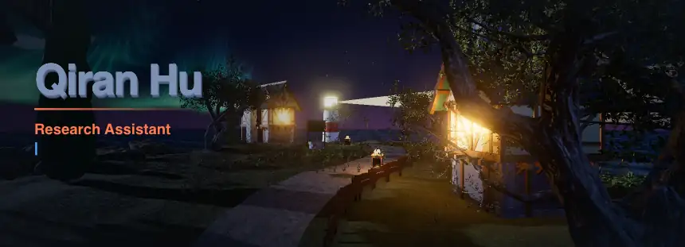
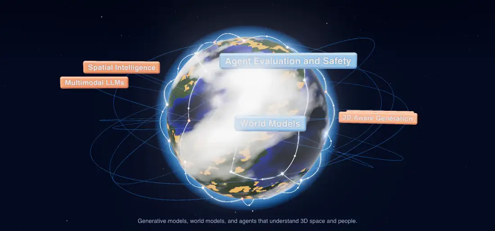
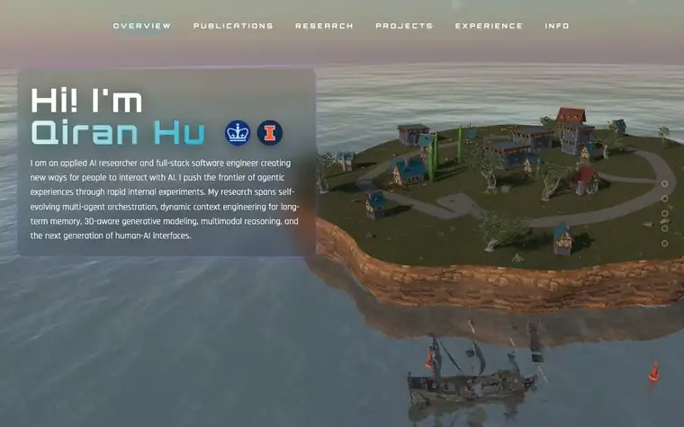

<!-- Generated cards live in assets/ (node scripts/render-assets.mjs) and on the output branch (GitHub Actions). -->
<picture>
  <source media="(prefers-color-scheme: dark)" srcset="assets/scenes/hero-dark.webp" />
  <source media="(prefers-color-scheme: light)" srcset="assets/scenes/hero-light.webp" />
  
</picture>

<!-- links:start -->

  <a href="https://edward-h26.github.io/" title="Website"><picture><source media="(prefers-color-scheme: dark)" srcset="assets/link-website-dark.svg" /><source media="(prefers-color-scheme: light)" srcset="assets/link-website-light.svg" /></picture></a>&nbsp;&nbsp;
  <a href="https://scholar.google.com/citations?user=4jv03f4AAAAJ&amp;hl=en" title="Google Scholar"><picture><source media="(prefers-color-scheme: dark)" srcset="assets/link-scholar-dark.svg" /><source media="(prefers-color-scheme: light)" srcset="assets/link-scholar-light.svg" /></picture></a>&nbsp;&nbsp;
  <a href="https://www.linkedin.com/in/qiranhu/" title="LinkedIn"><picture><source media="(prefers-color-scheme: dark)" srcset="assets/link-linkedin-dark.svg" /><source media="(prefers-color-scheme: light)" srcset="assets/link-linkedin-light.svg" /></picture></a>&nbsp;&nbsp;
  <a href="https://x.com/QiranHu" title="X"><picture><source media="(prefers-color-scheme: dark)" srcset="assets/link-x-dark.svg" /><source media="(prefers-color-scheme: light)" srcset="assets/link-x-light.svg" /></picture></a>&nbsp;&nbsp;
  <a href="mailto:qh2332@columbia.edu" title="Email"><picture><source media="(prefers-color-scheme: dark)" srcset="assets/link-email-dark.svg" /><source media="(prefers-color-scheme: light)" srcset="assets/link-email-light.svg" /></picture></a>

  +1 (347)-957-9176 
  

<!-- links:end -->

  

    I am a current student in <strong><a href="https://www.engineering.columbia.edu/about">Fu Foundation School of Engineering and Applied Science</a></strong> at <strong><a href="https://www.columbia.edu/">Columbia University</a></strong>.
  

  

    I am a research assistant in the <strong><a href="https://vision.ischool.illinois.edu/index.html">Computer Vision and Machine Learning Group</a></strong> at <strong><a href="https://www.illinois.edu/">University of Illinois Urbana-Champaign</a></strong>. I am also affiliated with the <strong><a href="https://www.ncsa.illinois.edu/">National Center for Supercomputing Applications</a></strong> and <strong><a href="https://nairrpilot.org/">National Artificial Intelligence Research Resource Pilot</a></strong>.
  

  

    Previously, I received my B.S. in Data Science and Information Science with minors in Computer Science and Statistics at <strong><a href="https://www.illinois.edu/">University of Illinois Urbana-Champaign</a></strong>.
  

  

    I am an applied AI researcher and full-stack software engineer creating new ways for people to interact with AI. I push the frontier of agentic experiences through rapid internal experiments. My research spans self-evolving multi-agent orchestration, dynamic context engineering for long-term memory, 3D-aware generative modeling, multimodal reasoning, and the next generation of human-AI interfaces.
  

## Research Focus

<a href="https://edward-h26.github.io/research/">
<picture>
  <source media="(prefers-color-scheme: dark)" srcset="assets/scenes/planet-dark.webp" />
  <source media="(prefers-color-scheme: light)" srcset="assets/scenes/planet-light.webp" />
  
</picture>
</a>

## Featured Paper

<!-- featured-paper:start -->
<table width="100%">
<tr>
<td width="400" valign="top"></td>
<td valign="top">
<b>SV4D 3.0: Single-Step 3D-Aware Diffusion for Multi-View-Consistent 4D Scene Generation</b> 
<b>Qiran Hu</b>, Wei Cao, Yaoyao Liu 
<i>Under Review</i>
</td>
</tr>
</table>
<!-- featured-paper:end -->

## News

- **[August 2026]** Our paper REVA: Reusable Evidence View Aggregation for Context-Efficient RAG Serving is accepted to the [IEEE International Conference on Data Mining (ICDM) 2026](https://www.datamining.org/).
- **[June 2026]** Our paper [AC3S: Adaptive Conditioning for 3D-Aware Synthetic Data Generation](https://arxiv.org/abs/2606.31204) is accepted to the [European Conference on Computer Vision (ECCV) 2026](https://eccv.ecva.net/).
- **[February 2026]** I am admitted to the M.S. in Data Science program at the [Fu Foundation School of Engineering and Applied Science](https://www.engineering.columbia.edu/about) at [Columbia University](https://www.columbia.edu/).

## Interactive 3D Portfolio

Click the preview to walk the island: scroll to move, look sideways with the arrow keys. Built with React and three.js.

## Education

  
  <strong>Columbia University</strong>, New York City, NY 
  <strong>MS in Data Science</strong> 
  Fu Foundation School of Engineering and Applied Science 
  <em>2026.08 - 2028.05</em>

 

  
  <strong>University of Illinois Urbana-Champaign</strong>, Champaign, IL 
  <strong>BS in Data Science and Information Science</strong> 
  Minors: Computer Science and Statistics 
  Siebel School of Computing and Data Science 
  <em>2022.08 - 2026.05</em>

 

## Papers

<!-- papers:start -->
<table width="100%">
<tr>
<td width="300" valign="top"></td>
<td valign="top">
<b>SV4D 3.0: Single-Step 3D-Aware Diffusion for Multi-View-Consistent 4D Scene Generation</b> 
<b>Qiran Hu</b>, Wei Cao, Yaoyao Liu 
<i>Under Review</i>
</td>
</tr>
</table>

<table width="100%">
<tr>
<td width="300" valign="top"></td>
<td valign="top">
<b><a href="https://arxiv.org/pdf/2606.31204">AC3S: Adaptive Conditioning for 3D-Aware Synthetic Data Generation</a></b> 
Eric Ji, <b>Qiran Hu</b>, Wufei Ma, Sarthak Jain, Yingying Li, Minh N. Do, Yaoyao Liu 
<i>European Conference on Computer Vision (<b>ECCV</b>), 2026</i>  
<a href="https://arxiv.org/pdf/2606.31204"><picture><source media="(prefers-color-scheme: dark)" srcset="assets/paper-link-pdf-dark.svg" /><source media="(prefers-color-scheme: light)" srcset="assets/paper-link-pdf-light.svg" /></picture></a>
<a href="https://ac3s.cvmlgroup.web.illinois.edu/"><picture><source media="(prefers-color-scheme: dark)" srcset="assets/paper-link-project-page-dark.svg" /><source media="(prefers-color-scheme: light)" srcset="assets/paper-link-project-page-light.svg" /></picture></a>
<a href="https://youtu.be/3jOJaT2a8iQ"><picture><source media="(prefers-color-scheme: dark)" srcset="assets/paper-link-video-dark.svg" /><source media="(prefers-color-scheme: light)" srcset="assets/paper-link-video-light.svg" /></picture></a>
<a href="https://arxiv.org/bibtex/2606.31204"><picture><source media="(prefers-color-scheme: dark)" srcset="assets/paper-link-bibtex-dark.svg" /><source media="(prefers-color-scheme: light)" srcset="assets/paper-link-bibtex-light.svg" /></picture></a>
</td>
</tr>
</table>

<table width="100%">
<tr>
<td width="300" valign="top"></td>
<td valign="top">
<b>REVA: Reusable Evidence View Aggregation for Context-Efficient RAG Serving</b> 
Tuan Nguyen, <b>Qiran Hu</b>, Banruo Liu, Khoa D. Doan, Kok-Seng Wong, Fan Lai 
<i>IEEE International Conference on Data Mining (<b>ICDM</b>), 2026</i>
</td>
</tr>
</table>

<table width="100%">
<tr>
<td width="300" valign="top"></td>
<td valign="top">
<b>AISim: Using LLM-Simulation as Epistemic Scaffolds for Early Stage Qualitative Research Design</b> 
Hangyue Zhang, <b>Qiran Hu</b>, Ziyi Zhang, Hyanghee Park, Yun Huang 
<i>Under Review</i>
</td>
</tr>
</table>

<table width="100%">
<tr>
<td width="300" valign="top"></td>
<td valign="top">
<b>AlphaWiSE: Adaptive Weight Interpolation for Continual Multimodal Representation Learning</b> 
Sarthak Jain, <b>Qiran Hu</b>, Zhen Zhu, Yaoyao Liu 
<i>Under Review</i>
</td>
</tr>
</table>
<!-- papers:end -->

## Research Experience

### **UIUC Computer Vision and Machine Learning Group**
**Undergraduate Research Assistant - Advised by Professor Yaoyao Liu** 
_Champaign, IL · 2025.05 - Present_

- Architect adaptive conditioning methods for 3D-aware synthetic data generation to enhance world model understanding and embodied agent performance in interactive simulations with geometry-conditioned diffusion approaches, reducing FID by 32.8% and increasing pose accuracy by 4.2x on PASCAL3D+.
- Conduct large-scale foundation model training across TB-level datasets on the National Center for Supercomputing Applications (NCSA) HPC clusters to enforce multi-view consistency with 4-bit NF4 quantization and low-level custom kernels, improving pose accuracy by 11.3% on PASCAL3D+ and reducing generation latency by 78.7% at p95.
- Design camera-controlled novel view synthesis on video generation pipelines to improve real-time perception for SLAM, visual odometry, and 3D reconstruction, reducing LPIPS by 21.0% on GSO and FV4D by 52.0% on OmniObject3D.

### **Multimodal Continual Learning Project**
**Undergraduate Research Assistant** 
_Champaign, IL · 2026.02 - Present_

- Selected for the NVIDIA Academic Grant Program Award to improve multimodal foundation models in class-incremental learning across audio, image, and text without catastrophic forgetting and cross-modal alignment drift, increasing R@1 by 27.6% on AudioSet.
- Advance post-hoc tensor-level weight-interpolation methods to improve multimodal retrieval through National Artificial Intelligence Research Resource (NAIRR) HPC clusters, reducing trainable parameters from 182M to 499 sigmoid-parameterized coefficients and increasing R@1 by 33.5% on AudioSet.
- Improve checkpoint fusion pipelines that merge separately trained checkpoints into a single model with no additional inference time, increasing last-task accuracy by 40.9% on UrbanSound8K.

### **Long-Form Video-Language and Audio-Visual Social Understanding**
**Undergraduate Research Assistant, University of Illinois Urbana-Champaign** 
_Champaign, IL · 2025.12 - 2026.05_

- Trained streaming video-language models with temporal transformer blocks for long-form video understanding beyond 30-minute sequences, increasing zero-shot accuracy by 17.4%.
- Designed context fluidity pipelines that fused facial action units, body pose, and prosody through cross-modal attention to infer social intent and conversational role from raw recordings, achieving 89.1% accuracy on speaker-role classification.
- Built video annotation pipelines for long clinical sessions with automatic transcription and detailed labeling, achieving 90.0% accuracy on role-inversion recovery.

## Professional Experience

### **Memoria**
**Founding Technical Lead** 
_Champaign, IL · 2026.01 - Present_

- Build end-to-end agentic workflow deployments for medium-sized businesses to deliver customized MCP servers, sub-agents, and agent skills that automate manual handoffs across each client's systems, reducing delivery time by 4.0x compared to traditional approaches.
- Improve self-evolving memory architectures for enterprise workflows to provide persistent per-user context without retraining, reducing token cost by 99.0%.
- Build production logging, monitoring, and evaluation infrastructure for system performance, user behavior, and cost.

### **Two by Two Learning**
**Full Stack Developer** 
_Champaign, IL · 2025.08 - 2026.08_

- Launched NOODEIA to help K-12 students who are falling behind grade level with multi-agent tutoring systems that plan, critique, and monitor each individual user with long-horizon memory through GraphRAG, increasing learner confidence by 2.4x in counterbalanced within-subjects studies.
- Advanced recency-biased FIFO memory architecture with self-evolving long-term memory that retrieves contextually relevant interactions, reducing memory query latency by 3.6x compared to PostgreSQL.
- Deployed complexity-aware model selection mechanisms across the planner, retrieval, solver, and critic stages that score each request and reserve frontier-tier inference for priority calls, reducing monthly serving cost by 89.9% compared to GPT-4o.

### **University of Illinois Urbana-Champaign Women's Resources Center**
**Data Analyst** 
_Champaign, IL · 2024.08 - 2024.12_

- Built paired pre/post analytics pipelines over survey data from 9,935 incoming students to measure seven learning outcomes for university-wide consent-education programs, increasing correct-response rates by 14.0% and reducing ambiguous responses by 61.9%.
- Conducted A/B tests on two consent scenarios stratified across five gender-identity subgroups to locate where misconceptions persisted after the workshop, achieving 19.5% improvement on consent comprehension.
- Proposed scenario-based learning modules for underrepresented subgroups by coding open-ended bystander responses into five-theme taxonomies, decreasing spread by 5.6x in direct-intervention rates.

## Research Projects

### **REVA: Reusable Evidence View Aggregation for Context-Efficient RAG Serving**
**Undergraduate Research Assistant** 
_Champaign, IL · 2026.02 - 2026.09_

- Proposed attention-based scoring for post-retrieval RAG context compression to reuse the generator's own attention traces across queries with a document-keyed score store built offline, achieving a 92.0% cache hit rate on HotpotQA.
- Developed word-unit scoring with original-order rendering for budgeted evidence materialization to preserve document structure under compression, increasing F1 by 13.2% on Natural Questions and reducing compression overhead by 96.7% compared to Selective Context.
- Optimized the online path of score lookup, quota allocation, and budget repair for interactive RAG serving, reducing compression latency by 98.9% compared to EXIT and 99.7% compared to FaviComp.

### **Multi-agent Research Synthesis Engine**
**Undergraduate Research Assistant** 
_Champaign, IL · 2025.11 - 2026.05_

- Orchestrated eight specialized agents across a 12-step workflow for automated literature synthesis to cover planning, retrieval, drafting, reflection, and safety review in a single loop with LLM-as-judge evaluation, achieving 95.5% accuracy on deep research pipelines.
- Optimized Semantic Scholar and Tavily tool calls for multi-source literature retrieval to reduce latency on the critical path with a bounded thread pool and typed fallbacks, reducing query time by 40.2%.
- Built Model Context Protocol servers for agent tool access to centralize governed tool integration behind one typed interface over academic databases, code repositories, and document stores, reducing integration latency by 87.5% across eight agents.

### **Realistic Neural Style Transfer Architecture**
**Undergraduate Research Assistant** 
_2025.01 - 2025.08_

- Architected style transfer frameworks for maintaining photorealistic results under highly abstract styles with VGG perceptual losses and edge-preserving constraints, improving SSIM by 77.0% and MS-SSIM by 49.0% compared to TensorFlow's NST.
- Proposed multi-layer Gram matrix losses with adaptive layer weighting to suppress texture and chromatic artifacts, increasing SSIM by 4.4x and MS-SSIM by 6.4x compared to ChatGPT-4o.

### **Anime Statistics and Analysis Platform, ASAP**
**Undergraduate Research Assistant** 
_2025.02 - 2025.06_

- Deployed interactive R Shiny analytics platforms to surface anime popularity trends and market opportunities with live Jikan REST API data and predictive analysis on shinyapps.io.

## Teaching

### **CS 107 Data Science Discovery, University of Illinois Urbana-Champaign**
**Teaching Assistant** 
_Champaign, IL · 2023.08 - 2026.05_

- Led weekly lab sections and office hours for in-person and online sessions, mentoring 1,200 students every semester through data science foundations in Python, statistical inference, data wrangling, and machine learning.
- Authored DISCOVERY Guides on the course website for self-serve concept review to provide every cohort the same worked explanations with applied Python and statistics walkthroughs.
- Designed problem sets, exam questions, test suites, and autograder scripts to deliver instant, consistent feedback to 1,200 students every semester on the course's mastery-learning platform.

## Service

### **OnePromptClaudeCode**
**Lead Developer** 
_2026.03 - Present_

- Open-source OnePromptClaudeCode under the MIT License for agentic software development to replace manual configuration with 95 agent skills, 14 specialized sub-agents, 10 MCP servers, and policy guardrails in one agent harness spanning planning, tool execution, review, and shipping.
- Design three-tier capability routers for the agent harness to optimize tokens, latency, and cost on every turn, with keyword matching and session-memory recall ahead of a 4.5 s model reasoning pass, resolving intent in 120 ms and running 37.5x faster than routing every prompt through the model.
- Improve the agent harness runtime for secure agent execution with four lifecycle hooks that gate every tool call before it runs, applying pattern-based deny rules to destructive commands, a pinned reasoning environment, and idempotent install modes with timestamped backups, reducing router latency by 92.7%.

## Honors

- [Neo4j Certified Professional](https://graphacademy.neo4j.com/c/2e386da7-2b30-4575-9fd0-b0b0918a6fe0/)
- [Neo4j Graph Data Science Certification](https://graphacademy.neo4j.com/c/6559f827-9dca-4199-bc9d-8be10fd74891/)
- UIUC Dean's List
- UIUC James Scholar

## Skills

<picture>
  <source media="(prefers-color-scheme: dark)" srcset="assets/skills-marquee-dark.svg" />
  <source media="(prefers-color-scheme: light)" srcset="assets/skills-marquee-light.svg" />
  
</picture>

  

**Languages:** Chinese (Native), English (Native), Spanish (Elementary)

## GitHub Activity

<picture>
  <source media="(prefers-color-scheme: dark)" srcset="https://raw.githubusercontent.com/Edward-H26/Edward-H26/output/stats-dark.svg" />
  <source media="(prefers-color-scheme: light)" srcset="https://raw.githubusercontent.com/Edward-H26/Edward-H26/output/stats-light.svg" />
  
</picture>

<picture>
  <source media="(prefers-color-scheme: dark)" srcset="https://raw.githubusercontent.com/Edward-H26/Edward-H26/output/milestones-dark.svg" />
  <source media="(prefers-color-scheme: light)" srcset="https://raw.githubusercontent.com/Edward-H26/Edward-H26/output/milestones-light.svg" />
  
</picture>

<picture>
  <source media="(prefers-color-scheme: dark)" srcset="https://raw.githubusercontent.com/Edward-H26/Edward-H26/output/code-dark.svg" />
  <source media="(prefers-color-scheme: light)" srcset="https://raw.githubusercontent.com/Edward-H26/Edward-H26/output/code-light.svg" />
  
</picture>

  <picture>
    <source media="(prefers-color-scheme: dark)" srcset="https://raw.githubusercontent.com/Edward-H26/Edward-H26/output/profile-night-rainbow.svg" />
    <source media="(prefers-color-scheme: light)" srcset="https://raw.githubusercontent.com/Edward-H26/Edward-H26/output/profile-green-animate.svg" />
    
  </picture>

<picture>
  <source media="(prefers-color-scheme: dark)" srcset="https://raw.githubusercontent.com/Edward-H26/Edward-H26/output/snake-dark.svg" />
  <source media="(prefers-color-scheme: light)" srcset="https://raw.githubusercontent.com/Edward-H26/Edward-H26/output/snake-light.svg" />
  
</picture>
